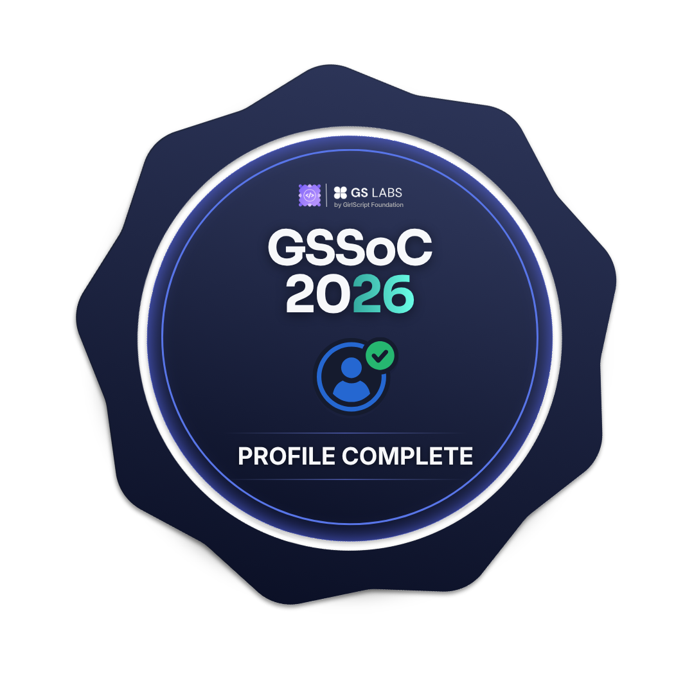

# Hi 👋 I'm Divyanshi Kumari

🎓 BTech CSE (Data Science) @ Manipal University Jaipur  
💻 Open Source Contributor | GSSoC'26 Participant  
🤖 Passionate about AI, Machine Learning and Data Science  

---

## 🏆 Badges

---

## 🏆 GSSoC 2026 Achievements

  
  
  

  
  
  

  
  
  

---

## 💻 Tech Stack

---

## 🚀 Projects

🔹 AI-Powered Waste Management System  
🔹 Demand Forecasting System  

---

## 📊 GitHub Stats

---

⭐ Thanks for visiting my profile!
